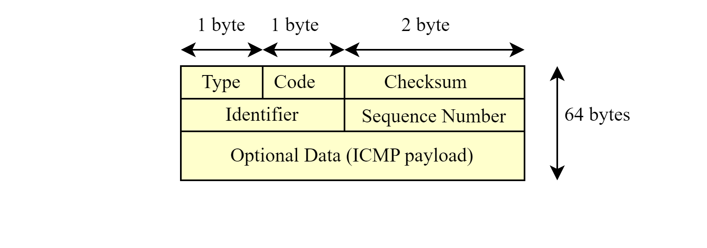

# ICMP 

ICMP (*Internet Control Message Protocol*) provides feedback about hosts and networks to the sender of an IP packet. As ICMP is part of the IP stack at layer-3. ICMP uses control messages, which are made up of a Type and Code value. In addition, some ICMP types use Identifier and Sequence numbers to track which process generated an ICMP request. ICMP message are encapsulated in IP datagrams.


# ICMP Fields

ICMP packet has following fields:

- Type: specifies the type of message(e.g. echo request, destination unreachable...).
- Code: provides additional information about the type of message.
- Checksum: verifies the integrity of data in the ICMP packet.
- Identifier: helps match an ICMP Echo Request with an Echo Reply.
- Sequence number: used in conjunction with the Identifier to help match Echo Request and Replies.
- Data: contains data specific to the type of message.

This ping program operates with a 64-byte ping packet.



# Overview

- Validate the IP address or the domain name (command line argument).
- Create the raw socket. 
- Drop root privileges. 
- Signal handler is registered to print the statistics of the ping request. Currently the program terminates only by receiving SIGINT signal(CTRL+C).
- The process id is used as Identifier(ICMP 2 byte field) to match ICMP Echo request and replies. 
- Create thread to handle the received packets(match only ICMP Echo replies with the correct Identifier).
- Ping the target from the main thread in an endless loop. 

# MAKEFILE

To build the program type:

**``` make ```** 

# Example of usage

Ping domain name:

**```./ping google.com ```**

Terminal output:
```
PING google.com(142.250.185.142): 64 bytes data in ICMP packets.
64 bytes from 142.250.185.142: icmp_seq=0 ttl=59 time=55.08 ms
64 bytes from 142.250.185.142: icmp_seq=1 ttl=59 time=54.25 ms
64 bytes from 142.250.185.142: icmp_seq=2 ttl=59 time=53.32 ms
64 bytes from 142.250.185.142: icmp_seq=3 ttl=59 time=55.01 ms
^C
--- 142.250.185.142 ping statistics ---
4 packets transmitted, 4 received, 0% packet loss, time 3581ms
```


Ping an IP address:

**``` ./ping 127.0.0.1 ```**

Terminal output:
```
PING localhost(127.0.0.1): 64 bytes data in ICMP packets.
64 bytes from 127.0.0.1: icmp_seq=0 ttl=64 time=0.10 ms
64 bytes from 127.0.0.1: icmp_seq=1 ttl=64 time=0.22 ms
64 bytes from 127.0.0.1: icmp_seq=2 ttl=64 time=0.19 ms
64 bytes from 127.0.0.1: icmp_seq=3 ttl=64 time=0.20 ms
^C
--- 127.0.0.1 ping statistics ---
4 packets transmitted, 4 received, 0% packet loss, time 3391ms
```


